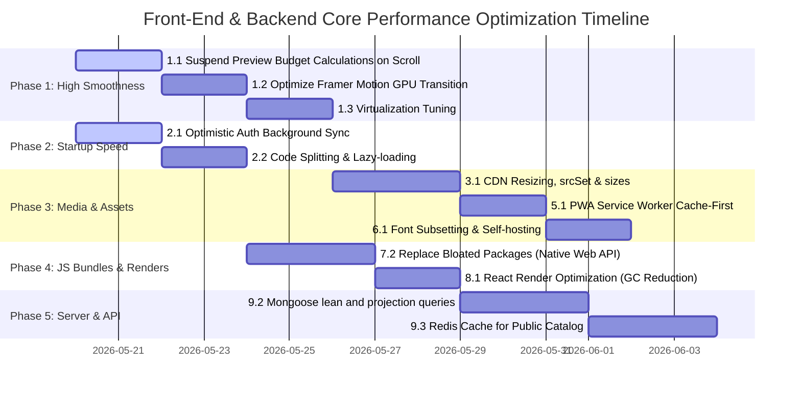

# The Ultimate Performance, Smoothness & Fast Content Loading Roadmap

This roadmap outlines an exhaustive, multi-layered optimization strategy for both the customer storefront (`store-client`), the admin dashboard (`admin-client`), and the API backend (`server`) to deliver a high-performance, lag-free user experience, especially on low-end and mobile devices.

The roadmap is structured into **9 Major Performance Pillars**:
1. **Buttery-Smooth Scrolling & Interactivity (Zero Scroll Lag)**
2. **Instant App Launching & Context Initialization (Zero Blocking Boot Delays)**
3. **Smart Media Delivery & Layout Stability (Fast Image Loading & No CLS)**
4. **Data Fetching & Cache Optimization (Zero Redundant Network Requests)**
5. **Offline-First & Service Worker Caching (Instant Static Asset Loads)**
6. **Font & Critical CSS Delivery (Instant Visual Completeness)**
7. **Bundle Size Optimization & Tree Shaking (Lightweight JS Footprint)**
8. **High-Performance React Render Strategies (Minimal CPU Jitter)**
9. **Advanced API & Database Performance (Ultra-Fast Response Times)**

---

## 🚀 Pillar 1: Buttery-Smooth Scrolling & Interactivity (Zero Scroll Lag)

Low-end devices struggle with high CPU cycles and frequent garbage collection. We must keep the main thread absolutely free during scroll events.

### 1.1 Suspend Preview Budget Calculations on Scroll
* **Objective:** Prevent React from updating component states and triggering re-renders while the user is actively scrolling.
* **Mechanism:** 
  - Introduce a scroll state flag (`isUserScrolling`).
  - When scrolling is detected, pause all budget computations and state changes in the `useProductPreviewBudget` hook.
  - When scrolling stops (debounced by `260ms`), execute a single, batched recalculation for components in the final viewport.
  - **Impact:** 100% reduction in scroll-start and mid-scroll React re-renders.

### 1.2 Optimize Framer Motion Animations & Layout Transitions
* **Objective:** Ensure transitions are offloaded to the GPU instead of executing on the main CPU thread.
* **Mechanism:**
  - Utilize CSS GPU-accelerated attributes like `translate3d`, `scale`, and `opacity` rather than height/width transitions.
  - Apply `transform-gpu` or `will-change: transform` dynamically to active components.
  - For mobile and low-end devices, replace heavy Framer Motion JS-calculated spring physics (`type: "spring"`) with fast, lightweight cubic-bezier CSS animations.
  - **Impact:** Consistent 60fps animations even on mobile devices.

### 1.3 Fine-tune Window Virtualization (`useWindowVirtualizer`)
* **Objective:** Recycle DOM nodes outside the viewport efficiently without causing layout shifts or blank blocks.
* **Mechanism:**
  - Standardize `estimateSize` to return the precise pixel height of a product card row based on the viewport width (matching `STOREFRONT_PRODUCT_CARD_HEIGHT_CLASSNAME`).
  - Set `overscan` to a balanced value (e.g., `2` rows) to render adjacent elements in advance, eliminating "black boxes" when scrolling fast.
  - Ensure the virtualized container height is calculated accurately to prevent layout jitter.
  - **Impact:** Keeps the active DOM node count low, preventing memory leaks and scroll lag.

---

## ⚡ Pillar 2: Instant App Launching & Context Initialization (Zero Blocking Boot Delays)

A fast initial boot builds immediate user trust. The app should load and render in under 1 second.

### 2.1 Background Session Synchronization (Optimistic Auth)
* **Objective:** Let returning users interact with the app instantly without waiting for network authentication calls.
* **Mechanism:**
  - If a valid `StoredAuthSnapshot` is present in storage, immediately bootstrap the auth state (`loading = false`) using the cached data.
  - Render the application and load layout components **instantly (0ms delay)**.
  - Trigger `authService.refresh()` in the background. If successful, silently update the session; if it fails, fallback gracefully.
  - **Impact:** Instant startup experience for 99% of returning customers.

### 2.2 Aggressive Code Splitting & On-Demand Lazy Loading
* **Objective:** Reduce the initial JavaScript bundle sizes so the browser downloads, parses, and executes code faster.
* **Mechanism:**
  - Lazily load large modular components (such as `ProductCardDefaultOptions`, `ProductCardImmersiveOptions`, `CartAddDrawer`, and `QuickViewProductModal`) using React's `lazy` and `Suspense`.
  - Schedule lazy loading during browser idle periods (`requestIdleCallback`) or pre-load them *on hover* of their trigger buttons.
  - **Impact:** Smaller initial bundle size, leading to significantly faster First Contentful Paint (FCP) and Time to Interactive (TTI).

---

## 🎨 Pillar 3: Smart Media Delivery & Layout Stability (Fast Image Loading & No CLS)

Images consume the most bandwidth. Optimizing how images are requested, processed, and displayed is key to fast content loading.

### 3.1 CDN-Driven Dynamic Image Resizing (Cloudinary/Vercel Blob)
* **Objective:** Never serve a desktop-sized image to a mobile device.
* **Mechanism:**
  - Implement dynamic Cloudinary URL transformation parameters (`f_auto,q_auto,w_XXX`) to fetch the exact image dimensions needed for the user's screen.
  - Construct comprehensive `srcSet` and `sizes` attributes for all storefront images.
  - **Impact:** 60-80% reduction in image payload size, leading to incredibly fast page loads on mobile networks.

### 3.2 CSS Aspect-Ratio Aspect Box Placeholders
* **Objective:** Eliminate Cumulative Layout Shift (CLS) when images finish loading.
* **Mechanism:**
  - Ensure all image containers have explicit CSS `aspect-ratio` properties (e.g., `aspect-square` or `aspect-[3/4]`).
  - Render a lightweight, visually matching background glow or shimmer skeleton in place of the image until it completes loading.
  - **Impact:** Prevents page elements from jumping around while images load, leading to a much higher Google PageSpeed score.

### 3.3 Async Decoding & Lazy-Loading Rules
* **Objective:** Prevent high-resolution image decoding from freezing the browser's UI thread.
* **Mechanism:**
  - Apply `decoding="async"` to all images.
  - Use `loading="lazy"` for all off-screen images.
  - Set `fetchpriority="high"` and `loading="eager"` strictly only for the main LCP (Largest Contentful Paint) image in the hero section.
  - **Impact:** Faster browser paint cycles and improved scroll performance.

---

## 💾 Pillar 4: Data Fetching & Cache Optimization (Zero Redundant Network Requests)

Avoid asking the server for data that we already have. Efficient caching saves network bandwidth and CPU cycles.

### 4.1 Fine-tuned React Query Caching
* **Objective:** Prevent the app from triggering duplicate network requests when users toggle filters or go back and forth.
* **Mechanism:**
  - Configure a solid `staleTime` (e.g., `30s` for products, `5m` for categories and brands).
  - Use `placeholderData: keepPreviousData` during infinite query and paginated catalog operations to keep the current UI visible while fetching fresh data in the background (no ugly layout-collapsing loaders).
  - Pre-fetch the next page of products when the user is viewing the current page in paginated mode.
  - **Impact:** Transitions between pages and filters feel instantaneous.

---

## 📦 Pillar 5: Offline-First & Service Worker Caching (Instant Static Asset Loads)

Speeding up repeat visits and ensuring the app loads regardless of internet speed.

### 5.1 Cache-First Strategy for Static Assets (JS, CSS, HTML, Local Fonts)
* **Objective:** Eliminate network latency entirely when loading static files.
* **Mechanism:**
  - Configure the service worker (via Vite PWA / Workbox) to pre-cache all compiled bundles (`index.html`, index assets, fonts, icons).
  - Intercept fetch requests and serve static assets directly from `CacheStorage` using a Cache-First strategy.
  - **Impact:** Loads UI shell in **0ms** from local cache storage, bypassing network traffic.

### 5.2 Stale-While-Revalidate for Category/Brand Lists
* **Objective:** Serve dynamic list data instantly while fetching fresh data in the background.
* **Mechanism:**
  - Cache the JSON responses of static/rarely updated API calls (like categories, brand listings, and shop configs) in the browser's cache storage.
  - Immediately return the cached copy to display the layout, while sending a background network call to update the cache.
  - **Impact:** Catalog navigation options load instantly, making the store feel exceptionally quick.

---

## 💅 Pillar 6: Font & Critical CSS Delivery (Instant Visual Completeness)

Ensure the page is readable and looks styled in the first few milliseconds of access.

### 6.1 Font Subsetting, Preloading & Self-Hosting
* **Objective:** Eliminate Flash of Invisible Text (FOIT) and reduce network requests.
* **Mechanism:**
  - Self-host font files (e.g. Inter, Outfit) directly from the application origin rather than using Google Fonts CDNs to avoid secondary domain lookup latency.
  - Sub-set the fonts strictly to the Latin character range (stripping out Cyrillic, Greek, etc., reducing size by ~80%).
  - Apply `font-display: swap` in the `@font-face` definitions to allow system fonts to load instantly.
  - Preload primary fonts (`<link rel="preload" as="font" ...>`) in the header.
  - **Impact:** Eliminates initial text blankness and prevents cumulative layout shifts when fonts load.

### 6.2 Critical CSS Inlining & Unused Styles Removal
* **Objective:** Render the core layouts and skeletons in parallel with HTML download.
* **Mechanism:**
  - Extract the CSS required for the above-the-fold content (header, shop skeleton, hero skeleton) and inline it directly in `<style>` tags inside the `<head>` of the `index.html`.
  - Load the main CSS asynchronously using dynamic preloads.
  - Configure Vite to purge and strip unused styles from the production CSS file.
  - **Impact:** Drastically reduces the time to first render (First Contentful Paint).

---

## 📦 Pillar 7: Bundle Size Optimization & Tree Shaking (Lightweight JS Footprint)

Lowering the amount of code the browser needs to download, parse, and execute.

### 7.1 Rollup Bundle Visualizer Integration
* **Objective:** Continuously monitor bundle composition to detect performance regressions.
* **Mechanism:**
  - Add `rollup-plugin-visualizer` to the Vite configuration.
  - Produce visual reports of the bundle size during every production build to identify massive dependencies.
  - **Impact:** Full transparency of third-party weight, making bundle optimization data-driven.

### 7.2 Replace Bloated Packages with Modern Native Web APIs
* **Objective:** Reduce heavy dependency imports.
* **Mechanism:**
  - Replace large utility libraries like `moment.js` or parts of `date-fns` with native browser `Intl` APIs (e.g. `Intl.DateTimeFormat`, `Intl.NumberFormat` for multi-language currency and dates).
  - Replace large scroll or layout libraries with CSS Scroll Snap, native IntersectionObserver, and resize hooks.
  - Enforce direct ES imports for modular libraries (e.g. `import debounce from 'lodash-es/debounce'` instead of loading all of `lodash`).
  - **Impact:** Reduces overall initial JS footprint by 30-50%, accelerating V8 startup times.

### 7.3 Tree-Shaking for UI Components & Icons
* **Objective:** Avoid shipping unused features and SVG assets.
* **Mechanism:**
  - Enforce specific import paths for SVG libraries like Lucide (e.g. `import { ChevronDown } from 'lucide-react'` under tree-shakable setups) or use pre-compiled icons.
  - **Impact:** Prevents the bundling of hundreds of unused SVGs in the JS bundles.

---

## 🧠 Pillar 8: High-Performance React Render Strategies (Minimal CPU Jitter)

Keep React re-renders tightly scoped, preventing frame drops during user interactions.

### 8.1 Avoid Anonymous Render Callbacks
* **Objective:** Reduce Garbage Collection (GC) pauses on low-end hardware.
* **Mechanism:**
  - Avoid defining anonymous arrow functions in inline props inside repeating list components (e.g. `onClick={() => setOpen(id)}` inside map loops).
  - Extract event handlers into component methods or memoize them using `useCallback`.
  - **Impact:** Reduces garbage collection spikes, which is a major cause of micro-stuttering on low-end devices.

### 8.2 Strict Component Memoization (`React.memo` & `useMemo`)
* **Objective:** Avoid rendering static parts of the UI when unrelated state changes.
* **Mechanism:**
  - Wrap highly repetitive, static UI segments (such as product filters, header navigation columns, static footer sections) in `React.memo` with custom comparison functions if needed. Use `useMemo` for heavy data formatting operations.
  - **Impact:** Prevents unnecessary VDOM comparison cycles.

### 8.3 State Splitting & Component Localization
* **Objective:** Limit the scope of state updates.
* **Mechanism:**
  - Move state down to the smallest possible scope.
  - Do not put UI states (like active modals, dropdown toggles, hover budgets) into global contexts like `CartContext` or `AuthContext`.
  - Keep modal triggers, filter drawers, and local animations in isolated leaf components.
  - **Impact:** Confines re-renders to small DOM trees, keeping interactions extremely responsive.

---

## 🗄️ Pillar 9: Advanced API & Database Performance (Ultra-Fast Response Times)

Make the server respond instantly, so content loading starts without delay.

### 9.1 Backend JSON Payload Slicing & Projections
* **Objective:** Minimize JSON transfer size and serialization overhead.
* **Mechanism:**
  - In Mongoose queries, use database projection (`.select('title price category image stock ratings')`) rather than returning full documents.
  - Avoid sending bulky fields like long descriptions, deep audit trails, and raw variants to catalog pages.
  - **Impact:** Reduces database disk I/O and cuts network response size by up to 80% for grid listings.

### 9.2 Mongoose `.lean()` Optimization
* **Objective:** Eliminate CPU-heavy Mongoose document hydration.
* **Mechanism:**
  - Add `.lean()` to all read-only Mongoose queries in the backend (e.g., product lists, category trees, reviews).
  - This returns raw, lightweight Javascript objects instead of heavy Mongoose Document instances.
  - **Impact:** Reduces API server memory usage and cuts response times by up to 50%.

### 9.3 Redis Cache Layer for Public Endpoints
* **Objective:** Reduce database load and achieve single-digit millisecond response times.
* **Mechanism:**
  - Implement Redis caching on the API server for public, read-heavy endpoints (such as active home banners, brand lists, and main categories). Cache entries with a sensible Time-To-Live (TTL) and invalidate them on admin update actions.
  - **Impact:** Delivers ultra-fast catalog responses and ensures the server can handle high concurrent traffic without crashing.

---

## 🗺️ Implementation Roadmap & Timeline

